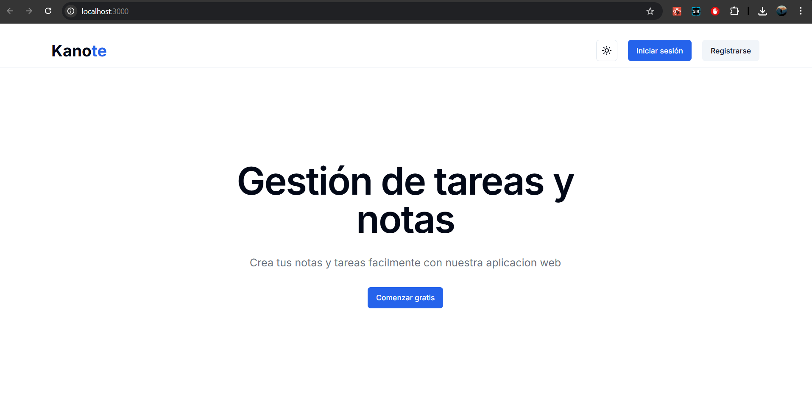
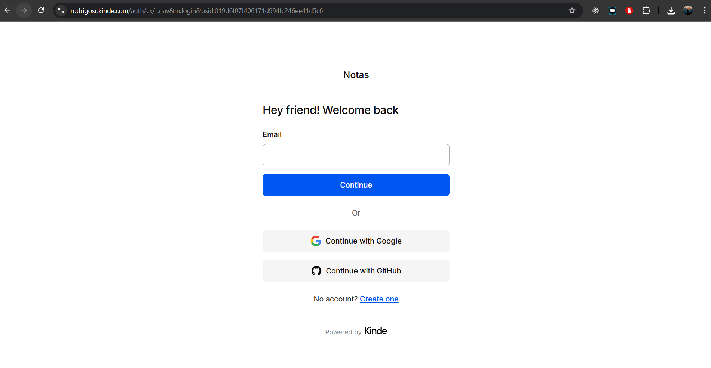

<div>
  <h1>Kanote 📝</h1>
  <p>A modern, full-stack Note-Taking SaaS application tailored for seamless productivity and elegant user experience.</p>
  
  [](https://nextjs.org/)
  [](https://www.typescriptlang.org/)
  [](https://tailwindcss.com/)
  [](https://www.prisma.io/)
  [](https://stripe.com/)
  
  <h2>Preview</h2
  

  <br>
  <h2>Login</h2>
  
</div>

---

## 📖 About The Project

Kanote is a highly scalable and interactive Note-Taking web-app designed to help users capture their ideas efficiently. It demonstrates a robust integration of modern web technologies, providing secure authentication, a rich text editing experience, dynamic multi-theming, and a fully functional premium subscription system handled by Stripe. 

This project was built with a strong focus on clean architecture, responsive UI, and developer best practices, making it an excellent showcase of full-stack capabilities.

## ✨ Key Features

- **🔐 Secure Authentication:** Seamless and secure log-in/sign-up flows powered by [Kinde Auth](https://kinde.com/).
- **📝 Rich Text Editor:** A highly interactive and customizable document editor powered by [TipTap](https://tiptap.dev/), supporting advanced formatting.
- **🎨 Dynamic Theming:** Personalized user experiences with dynamic color schemes (`theme-blue`, etc.) and dark mode support using Tailwind CSS and `next-themes`.
- **💳 Premium Subscriptions:** Complete Stripe integration for handling recurring payments, checkout sessions, and premium customer logic.
- **💾 Robust Data Modeling:** Implements a strongly typed PostgreSQL database using [Prisma ORM](https://www.prisma.io/), capturing Users, Subscriptions, and Notes effectively.
- **⚡ Modern Infrastructure:** Built with **Next.js 14 App Router**, taking advantage of React Server Components and Server Actions for optimal performance.

## 🛠️ Tech Stack & Architecture

- **Frontend:** Next.js 14, React 18, Tailwind CSS, shadcn/ui, Radix UI
- **Backend / API:** Next.js Server Actions, Node.js
- **Database:** PostgreSQL managed via Prisma ORM
- **Authentication:** Kinde
- **Payments Processing:** Stripe API
- **Deployment:** Vercel (Recommended)

## 🗄️ Database Schema Overview

The database contains three primary models:
1. **User**: Manages identities, linked to Kinde auth and Stripe customers. It also stores user preferences like custom color themes (`colorScheme`).
2. **Notes**: Handles the rich text content (`editorState`) linked to individual users.
3. **Subscription**: Tracks active Stripe subscriptions, plan IDs, and billing periods to gate premium features.

## 🚀 Getting Started

To get a local copy up and running follow these simple steps.

### Prerequisites

- Node.js (v18+)
- npm / pnpm / yarn
- PostgreSQL Database (e.g., Supabase, Neon)

### Installation

1. **Clone the repository**
   ```bash
   git clone https://github.com/Rodrigosot/Kanote.git
   cd Kanote
   ```

2. **Install dependencies**
   ```bash
   npm install
   ```

3. **Set up Environment Variables**
   Create a `.env` file in the root directory:
   ```env
   # Database (PostgreSQL)
   DATABASE_URL="your-postgresql-connection-string"

   # Kinde Authentication
   KINDE_CLIENT_ID="your-kinde-client-id"
   KINDE_CLIENT_SECRET="your-kinde-client-secret"
   KINDE_ISSUER_URL="your-kinde-issuer"
   KINDE_SITE_URL="http://localhost:3000"
   KINDE_POST_LOGOUT_REDIRECT_URL="http://localhost:3000"
   KINDE_POST_LOGIN_REDIRECT_URL="http://localhost:3000/dashboard"

   # Stripe
   STRIPE_SECRET_KEY="your-stripe-secret"
   STRIPE_WEBHOOK_SECRET="your-stripe-webhook-secret"
   ```

4. **Initialize Prisma Database**
   ```bash
   npx prisma db push
   # or npx prisma migrate dev
   ```

5. **Start the development server**
   ```bash
   npm run dev
   ```
   Navigate to `http://localhost:3000` to view the application in your browser.

## 🤝 Contributing

Contributions, issues, and feature requests are welcome!
Feel free to check the [issues page](https://github.com/Rodrigosot/Kanote/issues).

## 📄 License

Distributed under the MIT License.
